# VitaAI 桌面界面画廊

[返回项目介绍](../../README.md)

截图展示现有项目组件。简历分析报告使用内置示例；语音面试与面试报告使用本地临时展示页加载真实组件和虚构数据，不代表真实面试或模型评测结果。临时展示未写入业务数据库，未调用模型或语音服务。

模板仅保留两种代表版式。资料库与编辑器展示空白状态；设置仅截取对话框，账户邮箱与密钥未展示。

## 工作台与简历

### 我的简历

### AI 对话

### 简历编辑器

### 简历预览

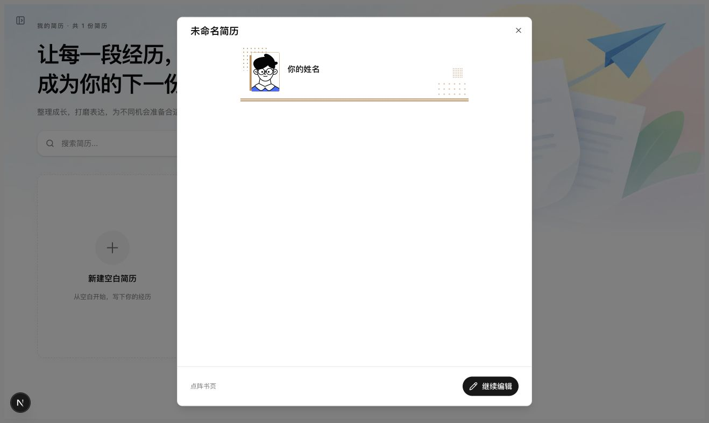

### 导出选项

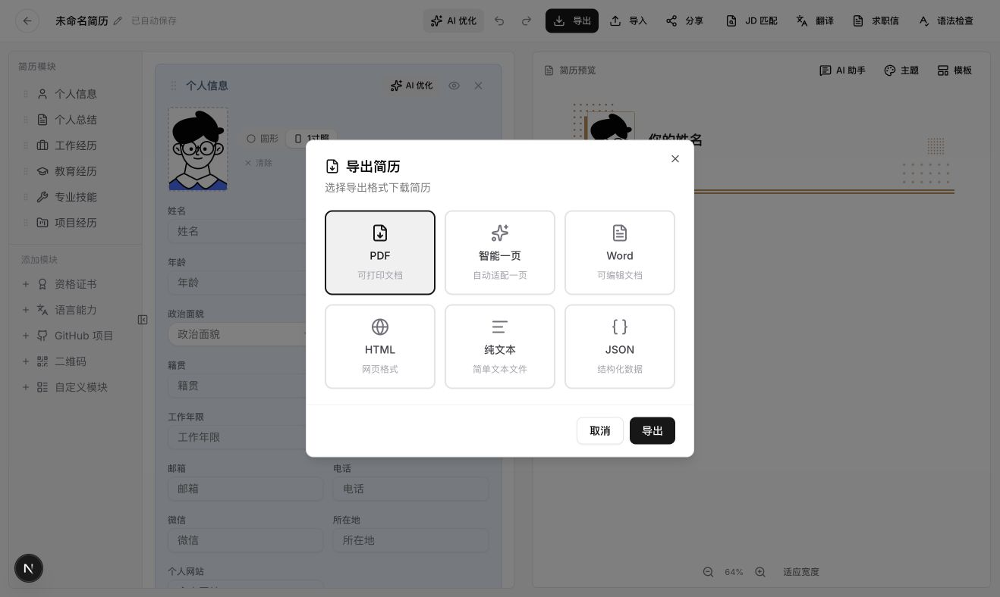

## 简历模板

### 模板库

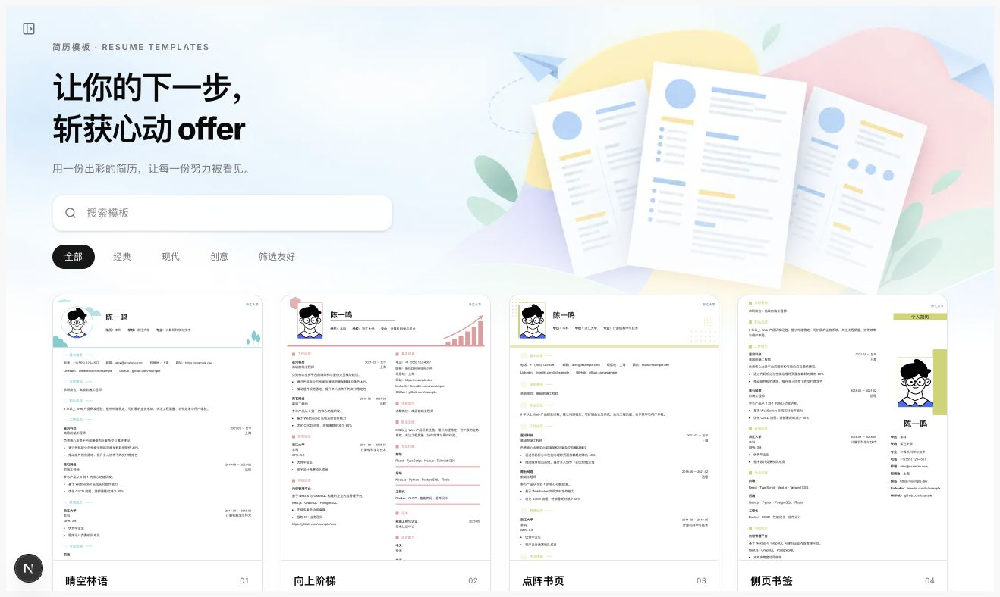

### 晴空林语

### 侧页书签：蓝色

## 个人资料库

### 基础信息

### 教育经历

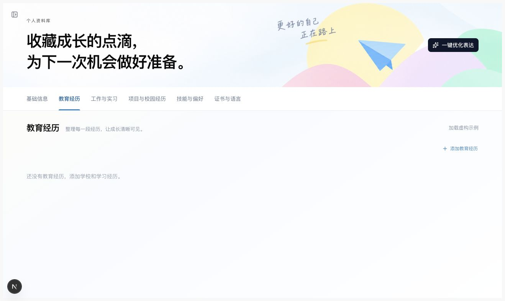

### 工作与实习

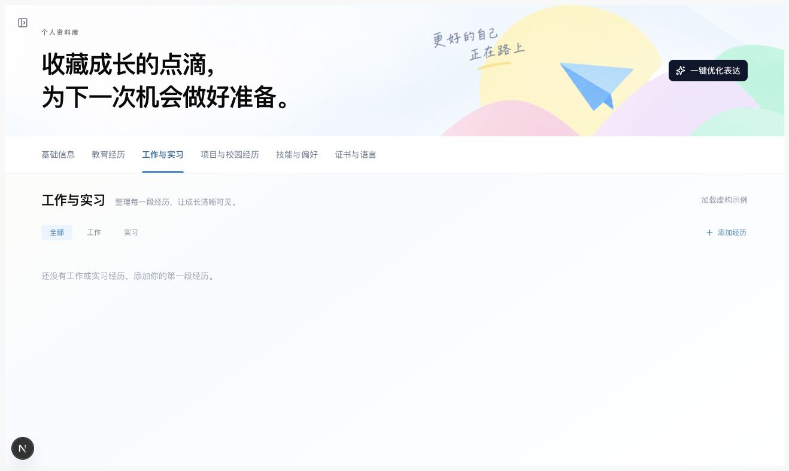

### 项目与校园经历

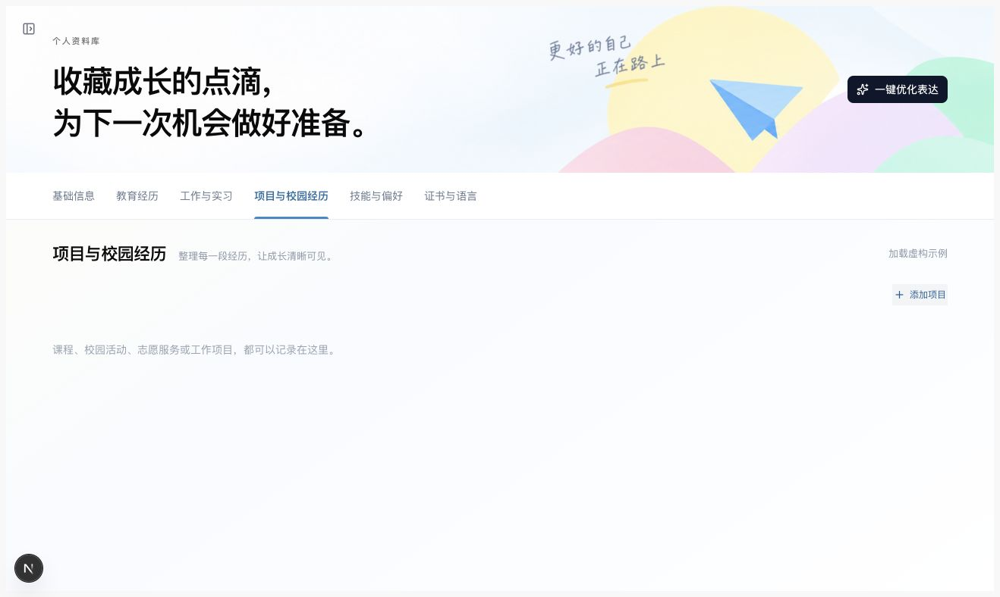

### 技能与偏好

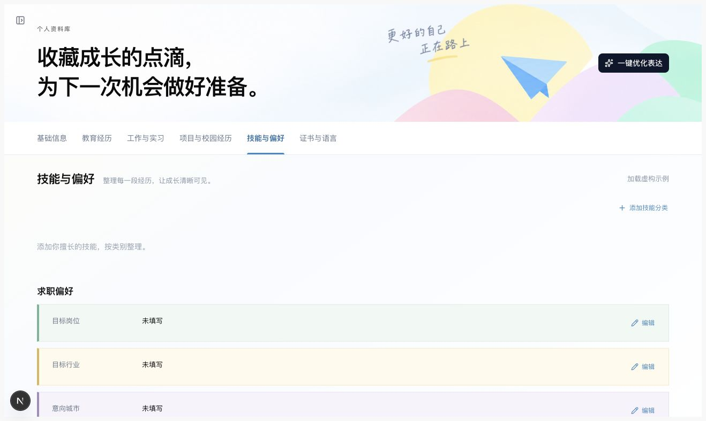

### 证书与语言

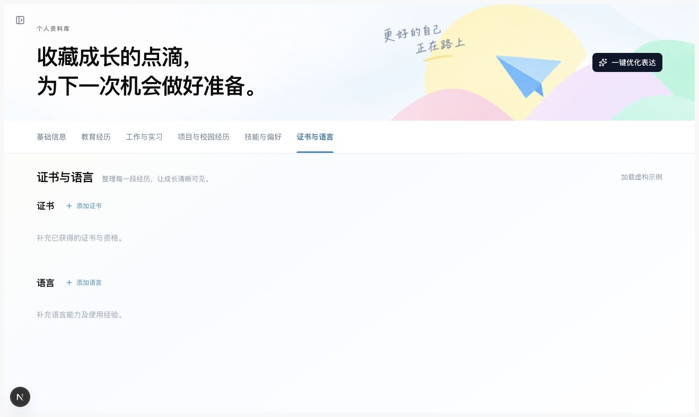

## 简历分析

### 分析入口

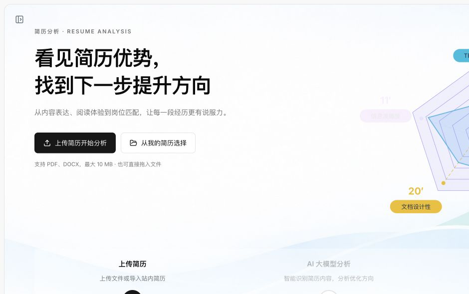

### 简历分析报告（内置示例）

## 模拟面试

### 模拟面试首页

### 岗位与简历

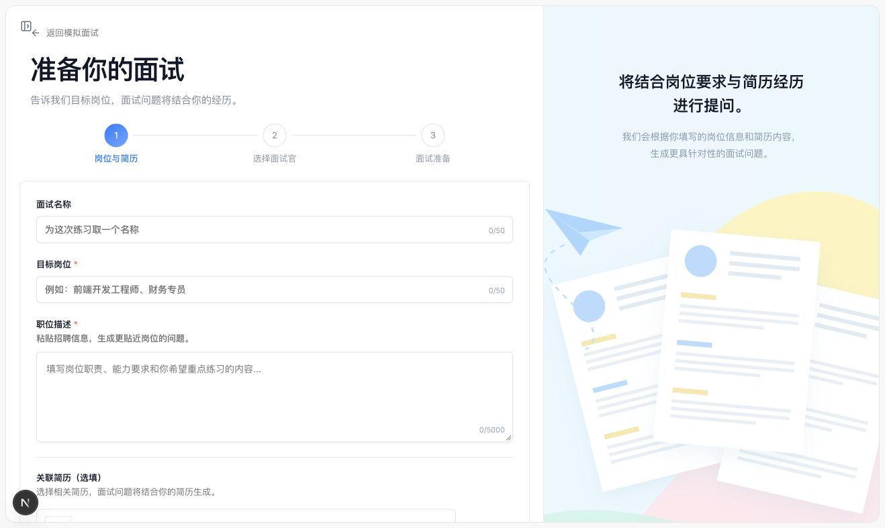

### 选择面试官

### 面试准备

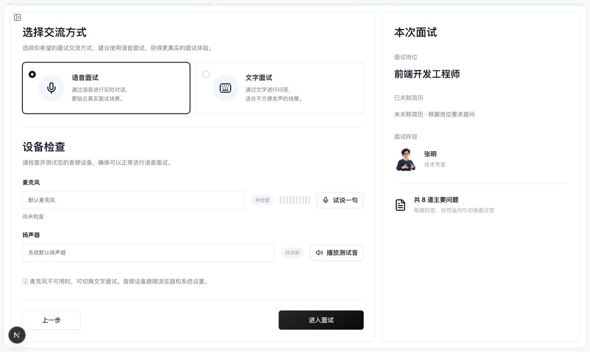

### 正式语音面试界面（虚构问答）

### 面试报告（虚构评分与评价）

## 设置

### 外观设置

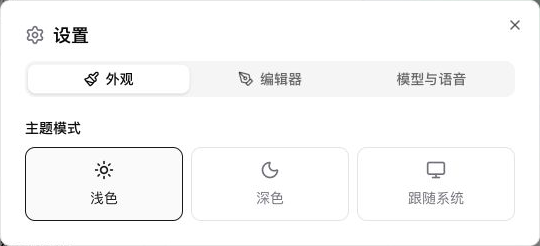

### 编辑器设置

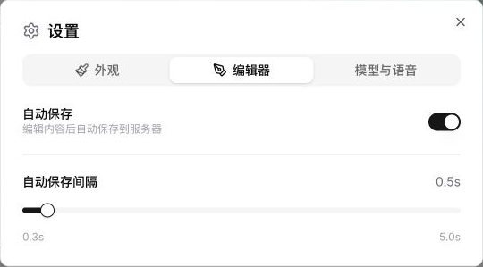

### 模型与语音配置

